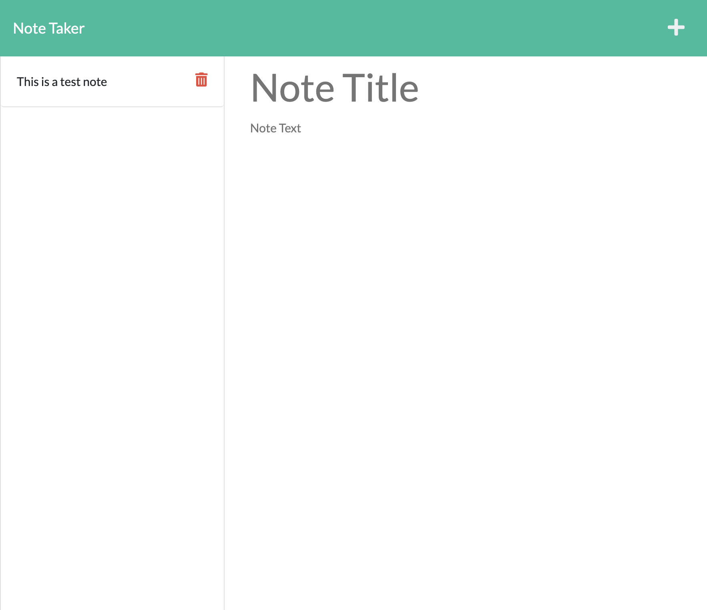

# Note Taker
This is a simple application that allows you to write notes with a title and description and save them

## Usage
1. Type in a title and description of your note
2. Hit the save icon at the top of the page.  Your note should then go to the left column
3. If you wish to view a note on the left column, simply click on it and it will populate on the right column
4. if you wish to delete a note, click the trash icon on the note in the left column

## Future Development
Ideas for improving this app are:
1. Add a "To-do" list section
2. Add date and time functionality to the notes
3. Color code notes by degree of importance

## Screenshot

## URL
chrisphailey.github.io/note-taker/
